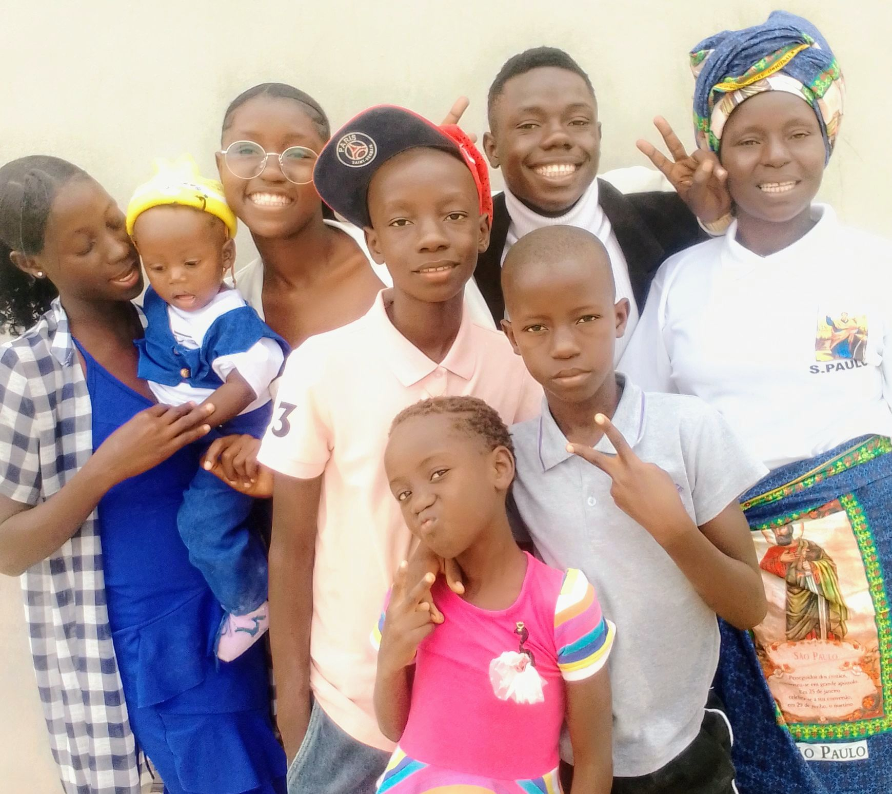

# Albino Ndjonale

Tel: +244930826392 | albinondjonale1@gmail.com | [Facebook](https://www.facebook.com/geovannindjonale) | [Instagram](https://www.instagram.com/albino.ndj/) | [LinkEdin](www.linkedin.com/in/albino-ndjonale-ab1450289) | [Whatsapp](thhps://wa.me/244930826392)

**Desenvolvedor FullStack e Desktop** a mais de 4 anos, voltado ao desenvolvimento de sistemas de alta perfromance a escalabilidade.

Sou altamente proficiente em pensamento analítico, com forte
domínio em matemática aplicada, o que me permite resolver problemas
complexos de forma estruturada e eficiente. Tenho facilidade com álgebra linear,
cálculo diferencial e integral, análise combinatória, probabilidades,
e otimização matemática — conhecimentos que aplico na modelagem de algoritmos,
estruturação de dados e análise de desempenho de sistemas. Minha capacidade
de abstração me permite interpretar grandes volumes de informação e
transformá-los em soluções práticas e eficientes.

**Formação**

- Curso Técnico Médio Em Gestão de Sistemas Informáticos (2020 - 2024)
- CCNAv7 na Academia Unitel (2024)
- Primeiro Ano em Engenharia Informática (2024/2025)

Bom conhecimen

**Tech Stack**

**My Love**

- Python
  - FastApi
  - Django
  - Flask
  - PyQt
  - PySide
- Php
  - Laravel
- JavaScript
  - Vue.js
  - Express.js
  - Prisma
- Rust
- Git
- Docker
- MySql
- PostgreSql
- SqLite

**Experiência Pratica**

- Desenvolvimento de Sistemas Web
- Desenvolvimento de Sistemas Desktop
- Aplicaçõse de Linha de Comando
- Projetos de Raspagem de dados em paginas web
- Automação de taréfas
